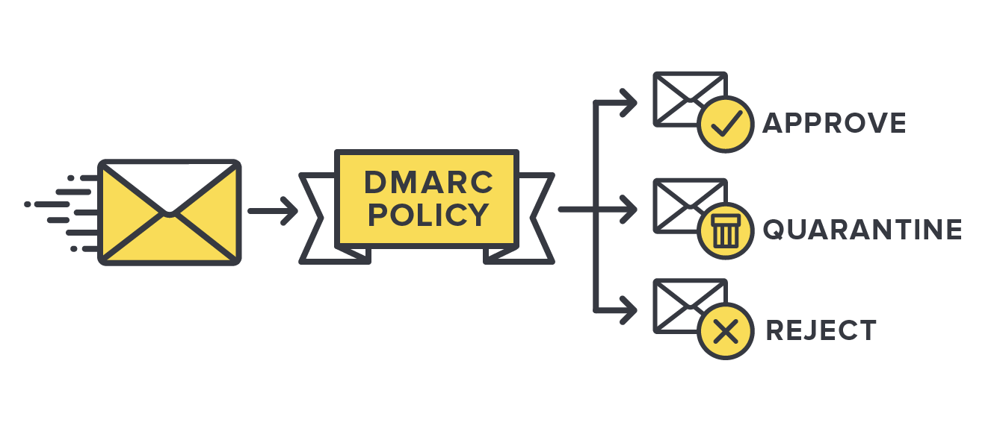
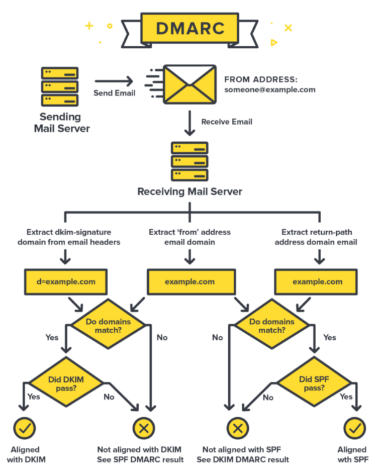

---		
title: 'DMARC Compliant'
classes: wide
---
<p align="center">
  
</p>

This past year, both Google and Yahoo decided to start enforcing [stricter requirements for bulk email senders](https://blog.google/products/gmail/gmail-security-authentication-spam-protection/).  In these requirements, among other things, is the need to authenticate email.  To authenticate emails, three things are needed: DMARC, DKIM, and SPF.

# DMARC
DMARC stands for Domain-based Message Authentication, Reporting, and Conformance.[^1]  The DMARC policy, or record, is established by creating a DNS TXT record.  Having this record would allow the email receiver to take certain actions if email authentication fails: Quarantine, reject, or Allow (or none).  But DMARC only defines the policy for what is done with failed email authentication.  To fully authenticate an email, three elements are used: DKIM, SPF, and domain alignment.  

# DKIM
DKIM stands for DomainKeys Identified Mail.[^2]  DKIM leverages the public key cryptography to authenticate an email and verify that the sending server can send on behalf of the domain.  To accomplish this, two elements are used: a DKIM record and the DKIM header.  

## DKIM Record
The first step in using DKIM is to publish a DKIM record in DNS.  This record, which is a DNS TXT record, stores the DKIM public key, making it available for reference by an email receiver.  Unlike most other DNS records created for email authentication, DKIM uses a specialized name, or selector, for its reference.  Consider the following example:

- DNS Name: `big-email._domainkey.example.com`
- Content: `v=DKIM1; p=76E629F05F709EF665853333EEC3F5ADE69A2362BECE40658267AB2FC3CB6CBE`

When an email is sent, the email sender will include within the DKIM header the selector.  It is through this selector that the email receiver can do a proper lookup for the DKIM record in DNS.  

## DKIM Header
As already mentioned, the sending email server creates a signature of the email headers and body by using the the DKIM private key.  This signature is included in the email headers so that it can be verified by the receiver.  

The following is an example of a DKIM header:
```
DKIM-Signature: v=1; a=rsa-sha256; q=dns/txt; c=simple/simple;
 s=15ca3b75e6386151; d=training.knowbe4.com; t=1705429238;
 h=from; bh=UXJuPxcJD1e16g0UF/jjoWtnpU60yLL4j8miabIJn0w=;
 b=SJlxW/sc6OnENOY1F0CbyRfVL3NJaiqvEWLFZUCBODJlE6Xx2tbvum26cX71zOxq4odR41
 PLUziqm4HWLhBKlD+DyK/ZUl1muYA+KTbm3zHIXUc2ftOCK+RX+2CLBfzl/baxGR9AR8YO
 SVHOwlb1j6mHYoIl5iHxw+ZGv4w5VgT9FacNrSHjwqMaIcNO/YM8COM4SKxPE/3/Z8Jzc2
 ATqH4qINlP/8Kxar6L3s2s0GirOwZEd6ot07hyuBCF8f8VKAamzUYHkC5Flk1HoYV0fmiq
 X8/k8mvxDBXYkpw+Yq1UNF3nwPubnaXyIFgY/m0hNN9t3IxY2dp7/k2jFCbVDw==
```
In this header there are different components, to which I describe several of them:
- `v=` Defines the version of DKIM being used.  
- `a=` Specifies the type of hashing algorithm used for the digital signature.  In this example, RSA-SHA-256 is being used.  
- `d=` The domain of the email sender
- `s=` The selector specified by the email sender.  In our example, the receiving would do a DNS lookup against the record `15ca3b75e6386151._domainkey.training.knowbe4.com`
- `h=` The list of header fields used to create the digital signature.  In the example above, the `from` field is used.  
- `bh=` The hash of the email body.  I assume that to avoid downloading the entire email body (because some emails are just too long), the email body hash is pre-generated by the sending server.  
- `b=` The digital signature, generated from `h` and `bh` and signed by the private key.  

Putting it all together, this allows the receiver to not only verify the authenticity of the email sender, but to ensure that the email has not been tampered.  Assuming that everything checks out, the receiver will give a `pass` for the DKIM check.  

# SPF
SPF stands for Sender Policy Framework.[^3]  This is a DNS TXT record which lists all of the servers authorized to send emails from particular domain.  I appreciate the explanation given by Cloudflare:
> Think of SPF records like a guest list that is managed by a door attendant. If someone is not on the list, the door attendant will not let them in. Similarly, if an SPF record does not have a sender’s IP address or domain on its list, the receiving server (door attendant) will either not deliver those emails or mark them as spam.

The following is an example SPF record:
```
v=spf1 include:_spf.psm.knowbe4.com ip4:192.0.2.1 -all
```
- `v=` this specifies that the string is an SPF record.  All SPF records must have this.  
- `include:examplesender.net` is considered an include tag.  The receiver email server will perform a TXT DNS lookup against that tag to find an expanded list of IP addresses.  In our example, a DNS lookup would return the following result showing all of the approved IP addresses:
```
v=spf1 ip4:23.21.109.197 ip4:23.21.109.212 ip4:147.160.167.14 ip4:147.160.167.15 ip4:52.49.235.189 ip4:52.49.201.246 -all
```
- `ip4:xxx.xxx.xxx.xxx/xx` allows to specify the specific addresses, instead of using a tag or hostname.  In our example, the address `192.0.2.1` is the whitelisted address.  You can also use CIDR notation to specify a block of addresses.  
- `-all` specifies that any IP addresses not provided in the SPF record should be rejected.  Alternative options to this include `~all` (called a soft-tail, allowing for other addresses to send but can be considered spam) and `+all` which signifies that any server can send an email.
> **_NOTE:_** the `all` statement must be the final element in the SPF record.  Anything given after the `all` should not be evaluated (if following RFC requirements).  

# Domain Alignment
In my research of DMARC policies and the associated SPF and DKIM records, I would not see the importance of domain alignment.  Let me leverage the following graphic to help explain domain alignment:

<p align="center">
  
</p>

In addition to the graphic, let's use the following example `Authentication-Results` header for reference:
```
Authentication-Results: spf=pass (sender IP is 147.160.167.14)
 smtp.mailfrom=psm.knowbe4.com; dkim=pass (signature was verified)
 header.d=training.knowbe4.com;dmarc=fail action=none
 header.from=example.com;compauth=pass reason=702
```
Let's start with SPF domain alignment.  We need to focus on two elements from the above header: `smtp.mailfrom` and `header.from`.  The `smtp.MailFrom` is officially called the `RFC5321.MailFrom`, but is also called `Return-Path`, `Bounce Address`, and `Envelope From:`.  The domain specified here is what is used to complete the SPF lookup.  The `header.from` is what is actually seen by the user in the email.  To be able to pass the DMARC policy, these domains must be identical, or aligned.  In our example, the `MailFrom` is `psm.knowbe4.com` but the `from` is `example.com`; therefore, even the SPF check passes, the domain alignment would fail and the overall DMARC check would fail.  

Now, to the DKIM domain alignment.  For this we'll focus on the `header.d`.  Similar to the SPF alignment check, both the `header.d` and `header.from` must be identical otherwise the alignment check will fail.  When using our example, the `header.d` is `training.knowbe4.com`; therefore, since the two domains are not identical, the alignment fails.  

Overall, as you can see from the example header, the DMARC is `dmarc=fail` or FAIL.
# DMARC Record
Now that we have explained SPF and DKIM records, along with Domain Alignment, we need to also explain and show a DMARC record. 

The following is an example DMARC record:
```
v=DMARC1;  p=none; rua=mailto:cfd6841657c34c018775be04662a46f9@dmarc-reports.cloudflare.net
```
- `v=DMARC1`: this indicates that the string is a DMARC record.
- `p=`: this is the policy tag.  It must have one of three values: `none`, `quarantine`, and `reject`.  
    - `none`: No action is to be taken and receiver can proceed with delivery
    - `quarantine`: The will specify a failed result to be placed into the `Junk` folder.  
    - `reject`: With a failed result the receiver is to outright reject the email.
- `rua=`: this allows for DMARC aggregated feedback reports to be sent to the domain owner.  This is where tools like Valimail can be used to evaluate the reports.  
- `ruf=`: allows for verbose or detailed reports of the failures to be sent back to the domain owner.  In my short experience with this record, few email receivers will actually send a detailed report.  
- `sp=`: this allows for subdomains, that do not already have a DMARC record, to have their own policy.

A DMARC record for a domain is created under the same DNS name: `_dmarc`.  Just like the other records, a DMARC record is also a TXT record.  Using our examples headers, a lookup can be completed at `_dmarc.training.knowbe4.com`.

# Useful Tools
The following are a few tools that I have found useful in checking SPF, DKIM, and DMARC records and their result:
- [DMARC Tester](https://www.dmarctester.com/): this tool has been the most helpful.  It allows you to send a test email and the system will analyze it.  Separately, it also allows for email headers to be pasted and analyzed.  
- [ValiMail](https://www.valimail.com/): Valimail provides a lot of good reference material and information.  Also, you can use them initially to receive and analyze DMARC results.  


[^1]: DMARC reference materials: [MXToolbox](https://mxtoolbox.com/dmarc/details/what-is-dmarc), [Cloudflare](https://www.cloudflare.com/learning/dns/dns-records/dns-dmarc-record/) 
[^2]: DKIM reference materials: [Cloudflare](https://www.cloudflare.com/learning/dns/dns-records/dns-dkim-record/)
[^3]: SPF reference materials: [Cloudflare](https://www.cloudflare.com/learning/dns/dns-records/dns-spf-record/)